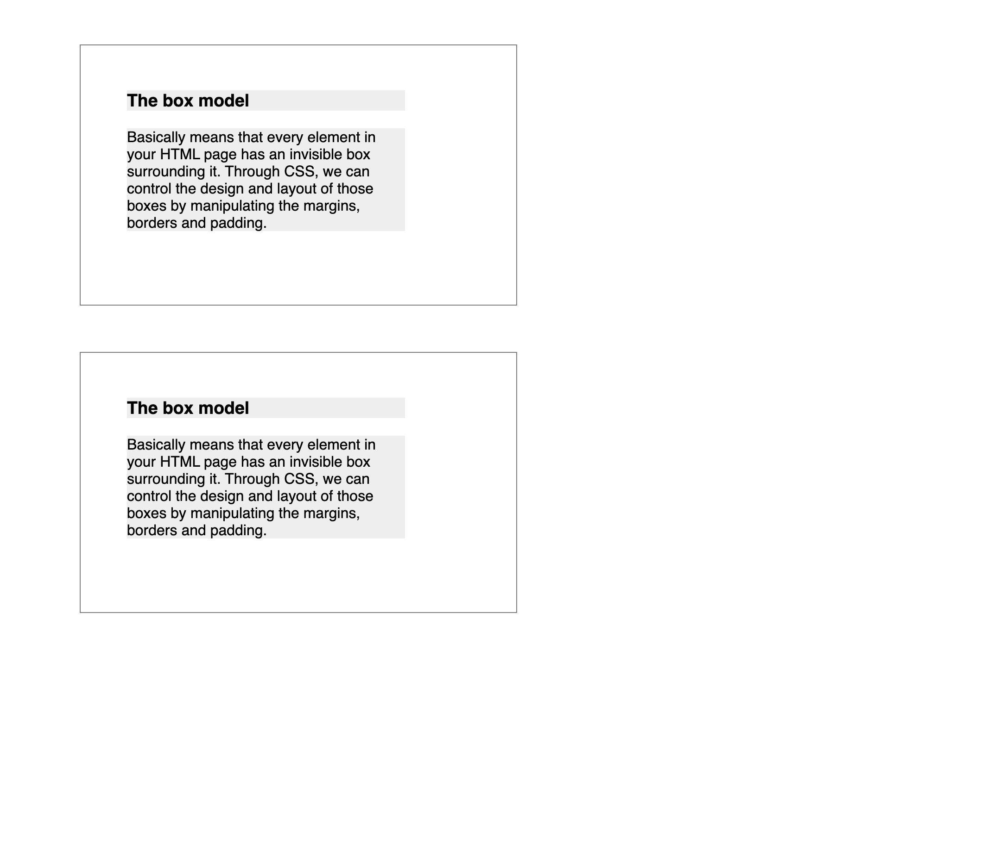
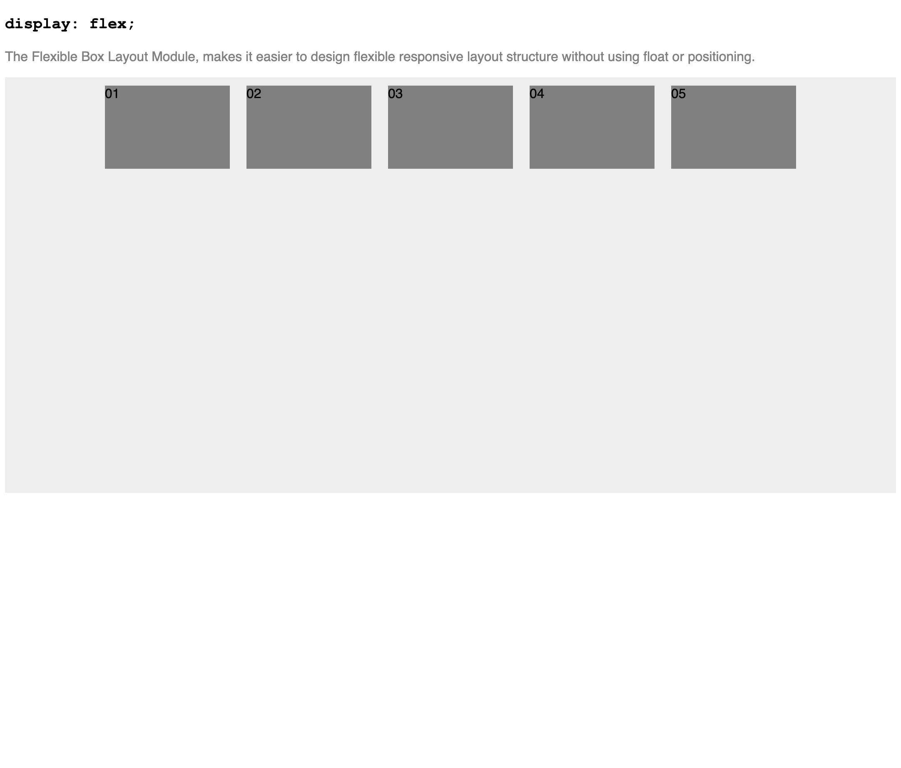
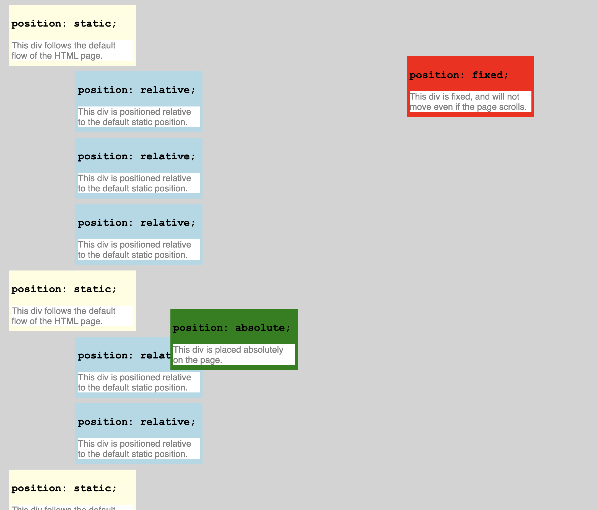
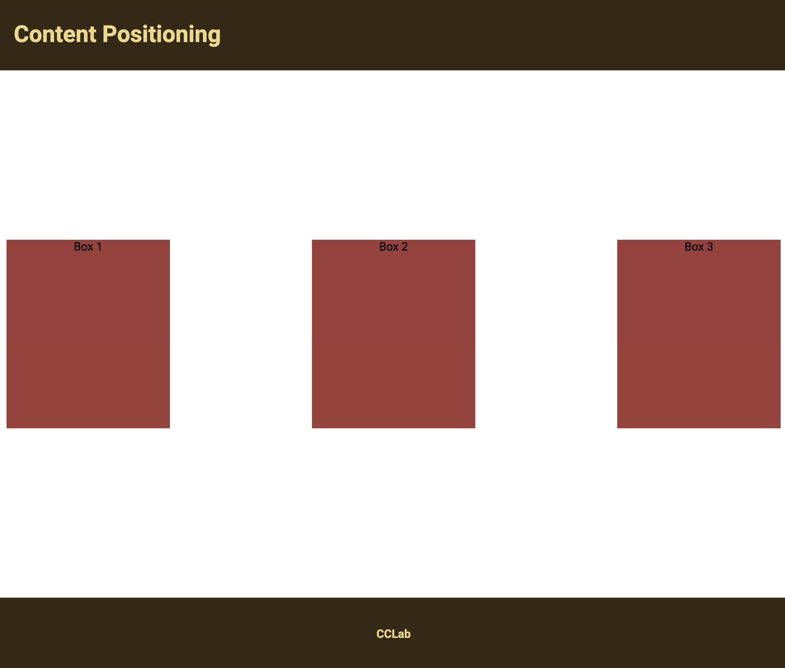
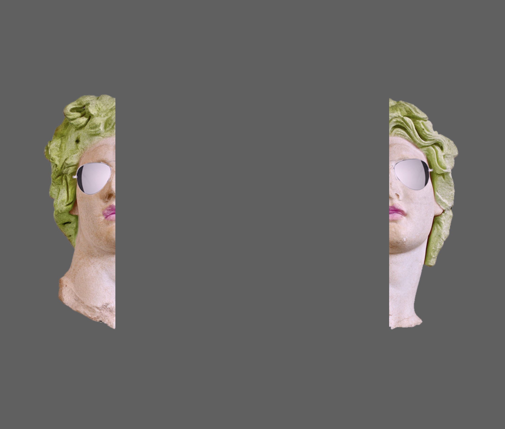
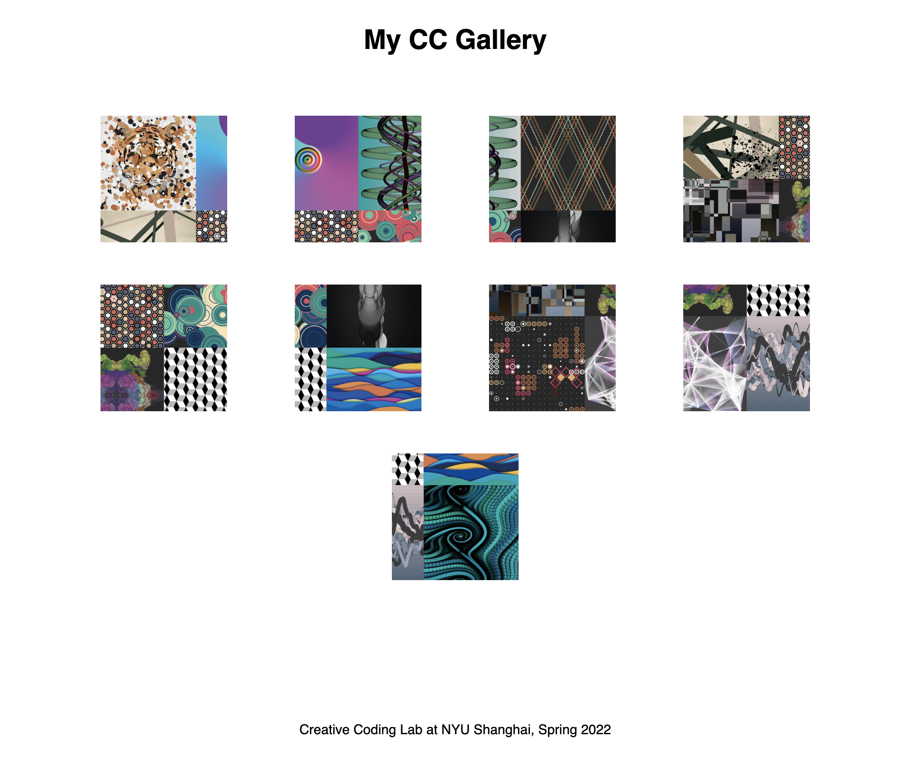

# CCLab22
 Repository for Creative Coding Lab, Spring 2022 (IMA, NYU SH). Access it on [GitHub Pages](https://stavrosdidakis.github.io/CCLab22/).

---

[01-html-css-js](https://stavrosdidakis.github.io/CCLab22/01-html-css-js).
Standard box model in CSS

</img>

---

[02-html-css-js](https://stavrosdidakis.github.io/CCLab22/02-html-css-js).
Use of flexbox

</img>

---

[03-html-css-js](https://stavrosdidakis.github.io/CCLab22/03-html-css-js).
CSS positioning examples

</img>

---

[04-html-css-js](https://stavrosdidakis.github.io/CCLab22/04-html-css-js).
Structuring positions for different elements

</img>

---

[05-html-css-js](https://stavrosdidakis.github.io/CCLab22/05-html-css-js).
Grid of elements. Usage of images for background and grid

</img>

---

[06-html-css-js](https://stavrosdidakis.github.io/CCLab22/06-html-css-js).
Multiple positioning settings for elements. Simple animations (hover on glasses for effect)

</img>

---

[07-html-css-js](https://stavrosdidakis.github.io/CCLab22/07-html-css-js).
A simple image gallery (with flex)

</img>

---

[08-html-css-js](https://stavrosdidakis.github.io/CCLab22/08-html-css-js).
Integration of a P5 sketch with a dynamic canvas window

</img>